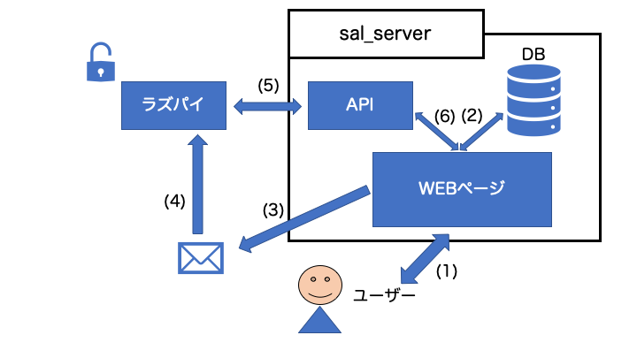

# ようこそ
ようこそ，魔のプロジェクト「公共施設利活用アプリ」へ．  
この資料は，去年，私たちが散々苦しめられたプロジェクトの仕様書である．  

この資料だけではわからないことがたくさん出てくると思うので，そのときは國宗研究室(7号館6F)の稲葉を訪ねてください．月曜と火曜4限と金曜の3限以外の平日午後は高確率でいます．

# 目次 
- [ファイル構成](../md/1-ファイル構成.md)
- [setting.py](../md/2-setting_py.md)
- [models.py](../md/3-models_py.md)
- [urls.py](../md/4-urls_py.md)
- [views.py](../md/5-views_py.md)
- [templates](../md/6-templates.md)
- [その他](../md/7-その他.md)
  
# 全体像

1. ユーザーがWEBページを見たり，予約情報を入力する．
2. ログインや予約などの情報をやりとり，djangoで操作可能
3. 予約したとき，登録したメールアドレスにメールを送信
4. メールに添付されたQRコードをラズパイに読み込ませる．
5. ラズパイがQRコードの情報をシステムに照会する．
6. APIがQRコードの情報をシステムに照会する．もし予約されていたとき，Trueを返す．
7. Trueを受け取ったラズパイは鍵ケースを開ける．
   
#### WEBページ
webページ  
DBとのデータのやりとり
#### DB
sqliteを使用．  
djangoのmodels.pyで操作可能なので，基本的にsqlはいじる必要ない．
#### API
ラズパイから送られてきたランダム文字列がDBに含まれていて，かつ，予約時間の前後-分の範囲の時間かを判定する．ラズパイにはTrueとFalseとだけ返す．
#### メール
QRコードが添付されている．  
QRコードにはランダム文字列の情報が入っている．
#### ラズパイ
QRコードリーダーでQRコードを読み取る．  
読み取ったランダム文字列をAPIに渡す．  
APIから返ってきた判定を元に鍵の開閉を行う．

# 
[次へ](../md/1-ファイル構成.md)