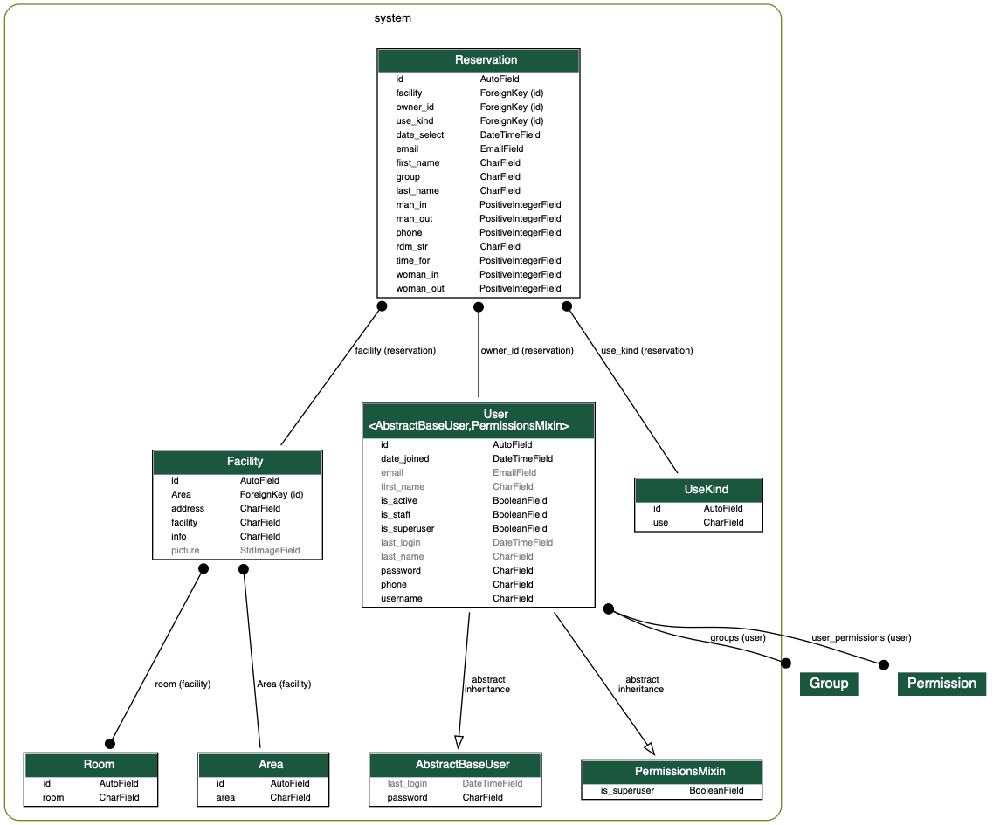

# models.py
ここではsystem/models.pyについて記述する．  
models.pyはdjangoのデータベースを管理するファイルである．

## ER図
本システムのデータベースは下図のようになっている

四角で囲まれているものがテーブルで，その中に含まれるidから始まる縦一列がカラム名である．  
テーブル同士の繋がりとして，1対多と多対多の2種類の繋がりがある．1対多はテーブルの間の片側黒丸の黒線である．このとき，黒丸側のテーブルの方に，繋がっているテーブルのidが格納される外部キーが存在する．また，白矢印は継承関係である．  
データベースはmodels.pyで作られており，テーブルがclass，その中で宣言されている変数がカラム名と対応する．

## テーブル
- User : ユーザーテーブル  
  ユーザー用のテーブルである．  
  UserManagerはユーザー周りの処理が書かれている．  
  参考URL : [https://narito.ninja/blog/detail/38/](https://narito.ninja/blog/detail/38/)
- Reservation : 予約テーブル  
  予約用のテーブルであり，予約情報入力で必要になるデータが集まったテーブルである．
- Facility : 施設テーブル  
  施設の情報が集まったテーブルである．
- Room : 部屋テーブル  
  施設の中に含まれる部屋のテーブルである．
- UseKind : 利用目的テーブル   
  予約時に選択してもらう利用目的用のテーブルである．
- Area : 場所テーブル
  施設が立っている場所のテーブルである．

#  
[前へ](../md/2-setting_py.md)
[目次](../md/0-はじめに.md)
[次へ](../md/4-urls_py.md)